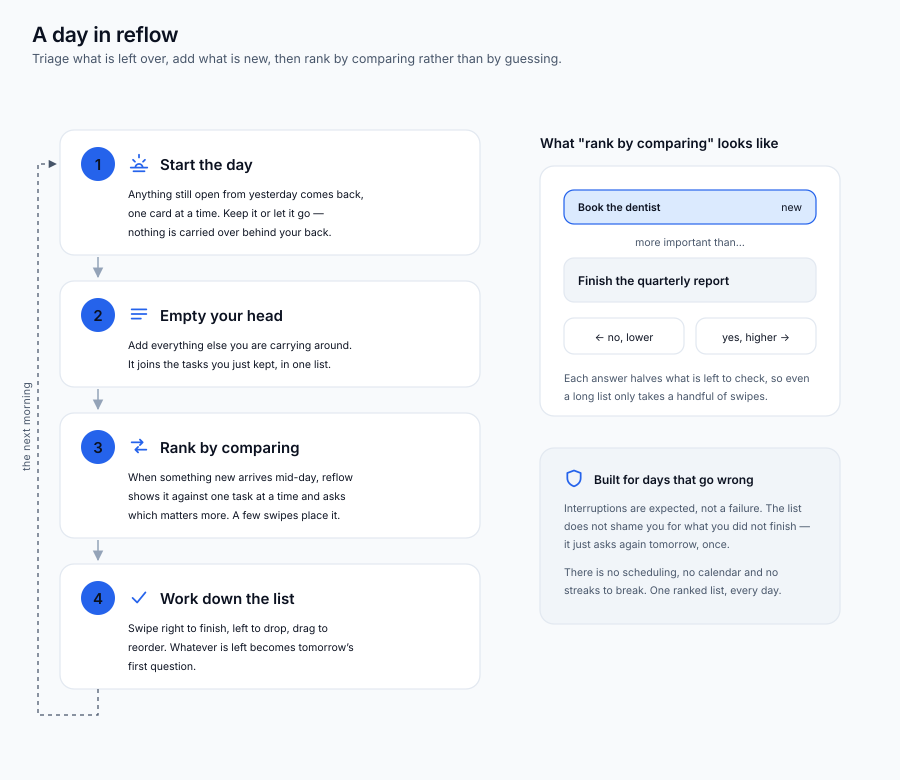
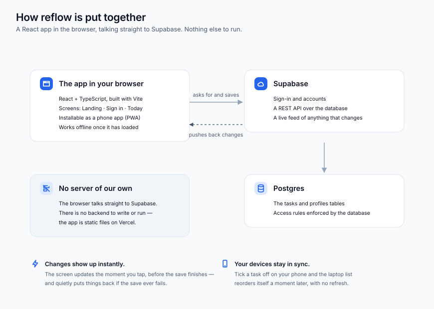
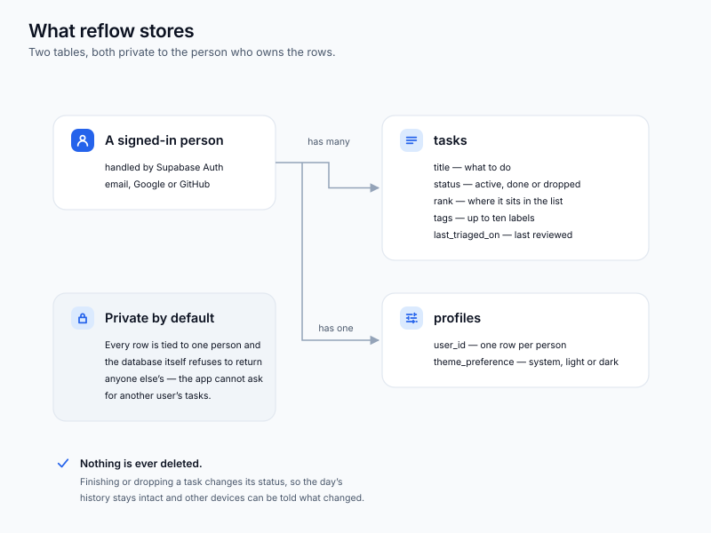
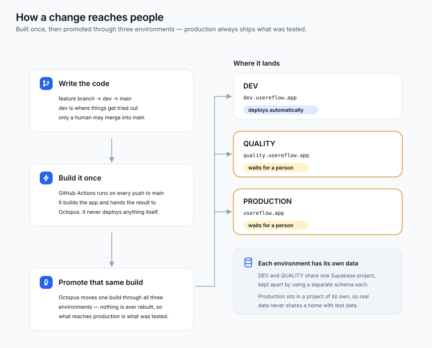

# reflow

A personal task-triage app: Vite + React + TypeScript on the frontend, talking directly to a hosted Supabase project (Postgres + Auth) with no custom backend.

Branching model is `feature/* → dev → main`, promoted to DEV/QUALITY/PROD by Octopus Deploy — see the `devops-workflow` Claude Code skill (`.claude/skills/devops-workflow/SKILL.md`) for the full flow rather than re-deriving it here.

## Overview

### A day in reflow



### How it is put together



### What it stores



### How a change reaches people



These four SVGs are generated, not drawn by hand — the sources live in [scripts/diagrams/](scripts/diagrams/) and `npm run diagrams` rewrites them. Each one ships a light and a dark palette and follows the reader's theme. Update the source and re-run whenever the schema, the module layout, or the deploy pipeline changes.

## Requirements

- **Node.js 20.19+ or 22.12+** (Vite 8 / Vitest 4 require this; Node 18 will not work)
- **npm** (bundled with Node)
- **Git**
- A **Supabase** account (free tier) — no Docker or local database needed; this project talks to a hosted Supabase project only

## Setup

1. Install dependencies:

   ```bash
   npm install
   ```

2. Create a Supabase project at [supabase.com](https://supabase.com) (free tier). From **Project Settings → API**, note the **Project URL** and the **publishable key** (formerly called the "anon" key — Supabase renamed it, but it's still the public client-side key).

3. In the Supabase dashboard:
   - **Authentication → Providers**: confirm Email is enabled, and leave "Confirm email" **on** — sign-up sends a confirmation link and won't return a session until it's clicked. (Google and GitHub sign-in are also available; enabling them needs OAuth apps registered with each provider — see `docs/plans/auth-oauth-and-email-confirm/archive/` for how this project's were set up.)
   - **SQL Editor**: run **every** file in [supabase/migrations/](supabase/migrations/) in filename order, starting with [0001_tasks.sql](supabase/migrations/0001_tasks.sql) (creates the `tasks` table with row-level security scoped to `auth.uid()`). Skipping a later migration leaves the database disagreeing with the app, which shows up as an opaque HTTP 400 on insert rather than a clear error.

   (The Supabase CLI isn't used for migrations here — this is a single-developer project, so the SQL files in the repo are just a readable record of the schema, applied by hand. If the app starts 400ing on writes, re-run the latest migration: they are written to be safe to apply more than once.)

4. Copy `.env.example` to `.env.local` and fill in your values:

   ```
   VITE_SUPABASE_URL=https://your-project-ref.supabase.co
   VITE_SUPABASE_ANON_KEY=your-publishable-key
   VITE_DEV_MODE=
   ```

   `.env.local` is gitignored — never commit real credentials.

5. Run the dev server:

   ```bash
   npm run dev
   ```

   Opens at `http://localhost:5173` (Vite picks the next free port if that one's taken).

## Optional: skip Supabase entirely (dev-mode auth bypass)

Set `VITE_DEV_MODE=true` in `.env.local` to bypass real Supabase auth with a mock session and seeded tasks — useful for quick UI checks or browser automation without setting up a Supabase project at all. See [src/lib/devMock.ts](src/lib/devMock.ts).

## Other commands

```bash
npm run build     # tsc -b && vite build
npm run preview   # preview the production build
npm run test      # vitest run
npm run lint      # oxlint
npm run diagrams  # regenerate the SVGs in docs/diagrams/
```

## Testing on a second device

```bash
npm run dev -- --host
```

Then open the printed "Network" URL (e.g. `http://192.168.1.23:5173`) on another device on the same network, signed in with the same account.

## Notes

- No Docker, backend server, or local database is required — Supabase is a hosted service reached over HTTPS.
- `.claude/settings.local.json` references an optional "Impeccable" design-critique Claude Code skill. It's not required to run or develop the app; the hook safely no-ops if the skill isn't installed locally.
- For how the app is actually built — data model, module map, the optimistic-mutation pattern, realtime sync, ranking/compare-duel mechanic — see [docs/ARCHITECTURE.md](docs/ARCHITECTURE.md).
